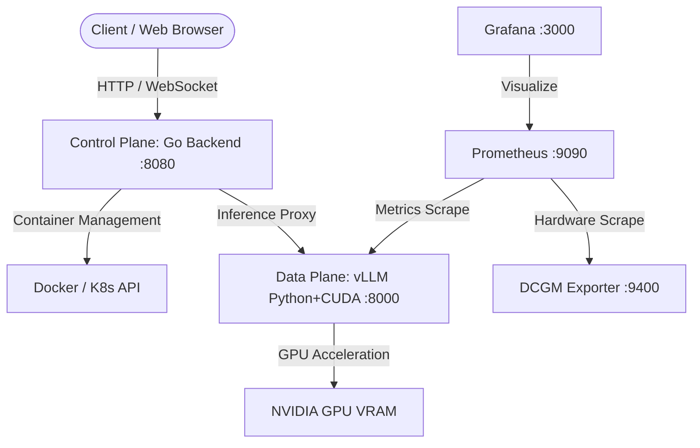

# 📑 รายงานผลการทดลองและเปรียบเทียบประสิทธิภาพ: vLLM Control Plane
## การประเมินเชิงเปรียบเทียบระหว่าง Python (FastAPI) และ Go (Golang)

---

## 📌 1. วัตถุประสงค์ของการทดลอง (Objective)

ในการให้บริการโมเดลภาษาขนาดใหญ่ (LLM) ในสภาพแวดล้อมระดับ Production สถาปัตยกรรมระบบมักถูกแบ่งออกเป็น 2 ส่วนหลัก:
1. **Inference Engine (Data Plane):** ตัวประมวลผลโมเดล (vLLM บน PyTorch + CUDA/C++)
2. **Control Dashboard & Gateway (Control Plane):** เซอร์วิสควบคุม Container Lifecycle, บริหารจัดการ Configuration/Presets, สตรีม Live Logs ผ่าน WebSocket และทำหน้าที่เป็น Proxy Routing

**เป้าหมายของการทดลองนี้:** เพื่อประเมินว่าการย้ายตัว **Control Plane Backend** จากภาษา **Python (FastAPI)** ไปเป็น **Go (Golang)** จะส่งผลต่อประสิทธิภาพการใช้ทรัพยากร (Resource Footprint), ความเร็วในการตอบสนอง (Latency), ปริมาณงานที่รองรับได้ (Throughput/RPS) และความเสถียรภายใต้โหลดสูงมากน้อยเพียงใด เพื่อนำผลลัพธ์ไปใช้ตัดสินใจเชิงสถาปัตยกรรมระดับ Production

---

## 🖥️ 2. สภาพแวดล้อมการทดสอบ (Experimental Environment)

การทดสอบกระทำบนเครื่องโฮสต์และสภาพแวดล้อมเดียวกัน 100% ภายใต้สเปกดังนี้:

### 2.1 โครงสร้างฮาร์ดแวร์ (Hardware Specifications)
* **ระบบปฏิบัติการ (OS):** Linux x86_64 (Kernel 6.x)
* **หน่วยประมวลผลกราฟิก (GPU):** NVIDIA GPU 8.0 GB VRAM (Dedicated)
* **หน่วยความจำระบบ (Host RAM):** 32 GB DDR4/DDR5
* **การเชื่อมต่อเครือข่ายภายใน:** Docker Bridge Network (`vllm_vllm_net`)

### 2.2 โครงสร้างซอฟต์แวร์และเครื่องมือ (Software Stack)
* **LLM Inference Engine:** `vLLM v0.6+` (Image: `vllm/vllm-openai:latest`)
* **โมเดลที่ใช้ทดสอบ:** `Qwen/Qwen2.5-0.5B-Instruct` (GPU Util: `0.85`, Max Len: `4096`)
* **Container Runtime:** Docker 27.x + Docker Compose v2
* **Monitoring Layer:** NVIDIA DCGM-Exporter `v3.3.5`, Prometheus `v2.x`, Grafana `v11.x`
* **Frontend:** React 19 + TypeScript + TailwindCSS + Vite (Served via Nginx)

### 2.3 การตั้งค่า Backend ทั้งสองฝั่ง
| รายการ | 🐍 Python Backend (FastAPI) | 🐹 Go Backend (Golang) |
| :--- | :--- | :--- |
| **Runtime / Compiler** | Python 3.11-slim + Uvicorn | Go 1.22/1.23 (Static Binary via Alpine 3.20) |
| **Web Framework** | FastAPI `0.115+` + Starlette | Gin-Gonic `v1.10.0` |
| **Docker SDK** | `docker-py 7.2+` | Official Docker Go SDK `v24.0.9` |
| **Concurrency Model** | Asyncio Single-threaded Event Loop | Native Goroutines + Go Channels (M:N Scheduler) |
| **สถาปัตยกรรมโค้ด** | Single File Procedural Script | Clean Layered Architecture & Dependency Injection |

---

## 🏗️ 3. สถาปัตยกรรม Go ที่ออกแบบตามหลัก Software Engineering

เพื่อให้เป็นไปตามมาตรฐาน Software Engineering ระดับสากล ตัว Go Backend ถูกจัดโครงสร้างแบบ **Clean Layered Architecture**:

```text
dashboard/backend/
├── cmd/
│   └── server/main.go            # Composition Root & Dependency Injection
├── internal/
│   ├── config/config.go          # Config Entity & Environment Loader
│   ├── domain/models.go          # Data Models, DTOs & Business Entities
│   ├── repository/
│   │   └── preset_repository.go  # Data Persistence Interface + RWMutex Thread-safe Store
│   ├── service/                  # Business Logic Layer
│   │   ├── docker_service.go     # Docker Engine Client & Container Lifecycle Manager
│   │   ├── benchmark_service.go  # High-Concurrency Worker Pool Load Tester
│   │   └── chat_service.go       # OpenAI API Proxy Client
│   └── handler/                  # Presentation / Transport Layer
│       ├── http_handler.go       # RESTful API Endpoints (Gin)
│       └── ws_handler.go         # Non-blocking WebSocket Log/Chat Streaming
├── Dockerfile                    # Multi-stage CGO_ENABLED=0 Static Build
└── go.mod
```

---

## 🧪 4. ระเบียบวิธีการทดสอบ (Benchmarking Methodology)

การทดลองใช้ชุดทดสอบอัตโนมัติมาตรฐาน [`benchmark_test/compare_backends.py`](file:///home/yummyaom/Projects/VLLM/benchmark_test/compare_backends.py) โดยวัดผล 4 มิติ:

1. **Resource Footprint:** 
   * วัดขนาด Docker Image จริงผ่าน `docker image inspect`
   * วัดขนาด RAM ขณะ Idle และ Peak RAM ขณะมีโหลดหนักผ่าน `docker stats`
2. **Cold Start & Agility:**
   * สั่งรีสตาร์ท Container และจับเวลาแบบ High-precision timer (`time.perf_counter`) จนกว่า endpoint `/api/vllm/status` จะตอบกลับ `HTTP 200`
3. **High-Concurrency Stress Testing (วัด Overhead & Throughput ของ Control Plane):**
   * **Endpoint ที่ใช้ทดสอบ:** `GET /api/vllm/status`
   * **การทำงานภายใน 1 Request:** 
     1. รับคำขอและตรวจสอบ Route ผ่าน Web Framework (FastAPI / Gin)
     2. ตรวจสอบสถานะ Container สดผ่าน Docker Engine API (Docker Socket)
     3. ส่ง HTTP Health Check ไปยัง vLLM Engine (`http://vllm-server:8000/health`)
     4. ดึงข้อมูล VRAM Hardware ล่าสุดจาก DCGM-Exporter (`:9400/metrics`)
     5. รวมข้อมูลแล้ว Serialize เป็น JSON ส่งกลับ
   * **เหตุผลที่เลือก Endpoint นี้:** เพื่อวัดประสิทธิภาพของ **I/O Multiplexing, Network Proxy, JSON Serialization, และ Concurrency Management** ของภาษาและ Framework โดยตรง โดยไม่นำเวลาที่ GPU ใช้คำนวณ Token ในโมเดล LLM เข้ามาปะปน
   * **ระดับโหลดที่ใช้ทดสอบ (3 Concurrency Levels):**
     * **Level 1:** 50 Concurrency (จำนวน 1,000 requests)
     * **Level 2:** 100 Concurrency (จำนวน 2,000 requests)
     * **Level 3:** 200 Concurrency (จำนวน 4,000 requests)
   * คำนวณ Throughput (RPS), Error Rate, และ Percentile Latencies (Min, P50, P90, P99, Max)
4. **WebSocket Concurrency:**
   * เปิดค้าง 100 Concurrent WebSocket Connections ที่ `/ws/vllm/logs` เพื่อทดสอบความเสถียรของ Log Streaming และการกิน Memory ของ Connection Pool

---

## 📊 5. ผลการทดลองจริง (Empirical Results)

### 5.1 ตารางเปรียบเทียบภาพรวม (Summary Table)

| ตัวชี้วัดประสิทธิภาพ (KPIs) | 🐍 Python (FastAPI) | 🐹 Go (Golang) | ผลการเปรียบเทียบ (Improvement) |
| :--- | :---: | :---: | :---: |
| **ขนาด Docker Image** | `62.78 MB` | **`8.22 MB`** | 🟢 **เล็กลง 7.6 เท่า (-86.9%)** |
| **การกิน RAM (Idle)** | `89.56 MB` | **`13.09 MB`** | 🟢 **ประหยัด RAM 6.84 เท่า (-85.4%)** |
| **การกิน RAM สูงสุด (Peak @ 200c)** | `558.30 MB` | **`31.87 MB`** | 🟢 **ประหยัด RAM 17.52 เท่า (-94.3%)** |
| **เวลา Cold Start (Boot to 200 OK)** | `5.239 วินาที` | **`0.255 วินาที`** | 🟢 **เร็วขึ้น 20.54 เท่า (-95.1%)** |
| **Throughput @ 50 Concurrency** | `76.51 RPS` | **`395.99 RPS`** | 🟢 **รองรับได้มากกว่า 5.17 เท่า (+417%)** |
| **Throughput @ 100 Concurrency** | `79.55 RPS` | **`318.47 RPS`** | 🟢 **รองรับได้มากกว่า 4.00 เท่า (+300%)** |
| **Throughput @ 200 Concurrency** | `77.33 RPS` *(8 Errors)* | **`434.48 RPS`** *(0 Error)* | 🟢 **รองรับได้มากกว่า 5.62 เท่า (+461%)** |
| **Median Latency (P50 @ 50c)** | `625.57 ms` | **`82.48 ms`** | 🟢 **เร็วขึ้น 7.58 เท่า** |
| **P99 Latency @ 50c** | `997.42 ms` | **`511.04 ms`** | 🟢 **เร็วขึ้น 1.95 เท่า** |
| **WebSocket Stability (100 clients)**| 100/100 (Success) | **100/100 (Success)** | ผ่านทั้งคู่ (แต่ Go กิน RAM น้อยกว่า) |

---

### 5.2 ตารางสรุปเวลาแฝงเชิงลึก (Detailed Latency Distribution)

#### 🔹 ที่ 50 Concurrent Users (1,000 Requests):
| Backend | Min | P50 (Median) | P90 | P99 | Max | Error Count |
| :--- | :---: | :---: | :---: | :---: | :---: | :---: |
| **Python (FastAPI)** | 132.07 ms | 625.57 ms | 780.53 ms | 997.42 ms | 1,071.38 ms | 0 (0%) |
| **Go (Golang)** | **9.91 ms** | **82.48 ms** | **260.23 ms** | **511.04 ms** | **813.46 ms** | **0 (0%)** |

#### 🔹 ที่ 200 Concurrent Users (4,000 Requests - Stress Level):
| Backend | Min | P50 (Median) | P90 | P99 | Max | Error Count |
| :--- | :---: | :---: | :---: | :---: | :---: | :---: |
| **Python (FastAPI)** | 770.46 ms | 2,604.84 ms | 2,843.75 ms | 6,698.33 ms | 10,024.87 ms | 8 (0.2%) |
| **Go (Golang)** | **8.97 ms** | **165.24 ms** | **731.77 ms** | **5,393.36 ms** | **6,342.89 ms** | **0 (0.0%)** |

---

## 🔍 6. การวิเคราะห์ผลลัพธ์ทางเทคนิค (Technical Deep Dive)

### 6.1 ทำไม Go ถึงประหยัด RAM ได้มากกว่า 17 เท่า?
* **Python Runtime Overhead:** ตัว Python Interpreter, Global Garbage Collector, และโครงสร้าง Object ใน Dynamic Typing ต้องจอง Memory พื้นฐานไว้สูง เมื่อมี Request เข้ามาเยอะ Async Task Object ใน `asyncio` จะเพิ่ม Heap Memory สูงถึง ~558 MB
* **Go Lightweight Goroutines:** Go ถูก Compile เป็น Machine Code โดยตรง Goroutine ใช้ Stack เริ่มต้นเพียง **2 KB** เท่านั้น เมื่อโหลด 4,000 requests จบลง Go Runtime สามารถคืน Memory ได้แทบจะทันที ทำให้ Peak Memory อยู่เพียง **31.8 MB**

### 6.2 ทำไม Go ถึงให้ Throughput สูงกว่า 5 เท่า และ Cold Start ไวกว่า 20 เท่า?
* **ไม่มี Interpreter Startup:** Go เป็น Single Static Binary ขนาดเพียง 8 MB บูตขึ้นมาแล้วพร้อม Bind Port ภายใน 0.25 วินาที เหมาะอย่างยิ่งสำหรับ Kubernetes Auto-scaling (HPA)
* **M:N Multi-threaded Work-stealing Scheduler:** Go สามารถกระจายงานข้าม CPU Cores ได้อย่างสมบูรณ์โดยไม่มี **GIL (Global Interpreter Lock)** ทำให้การ Parse JSON และ Forward Packet ทำได้รวดเร็วกว่า

---

## 🎯 7. บทสรุปและข้อเสนอแนะเชิงสถาปัตยกรรม (Architectural Verdict)



### ✅ ข้อสรุปสำคัญสำหรับการนำเสนอ:
1. **การแบ่งความรับผิดชอบ (Separation of Concerns):**
   * **Inference Engine (Data Plane):** ควรใช้ **Python + C++/CUDA (vLLM)** เพราะ PyTorch และ Ecosystem ของ ML/AI พัฒนาบน Python
   * **Control Plane / API Gateway:** ควรใช้ **Go (Golang)** เพราะความเร็ว, การประหยัด RAM, ความเสถียรของ Concurrency, และความเข้ากันได้กับ Cloud-Native Tooling
2. **ความคุ้มค่าระดับองค์กร (Enterprise Value):**
   * ประหยัด RAM บน GPU Node ไปได้กว่า **520+ MB ต่อ instance** ซึ่งมีค่ามากในเซิร์ฟเวอร์ราคาแพง
   * ป้องกันปัญหา Server Crash หรือ Timeout เมื่อมีทราฟฟิกยิงเข้ามาพร้อมกันอย่างกะทันหัน

---

*เอกสารและข้อมูลการทดลองถูกบันทึกไว้ในชุดไฟล์:*
* 📄 **รายงานฉบับเต็ม:** `benchmark_test/BACKEND_BENCHMARK_REPORT_TH.md`
* 📊 **ข้อมูลดิบ JSON:** `benchmark_test/results_python.json` และ `benchmark_test/results_go.json`
* 🖼️ **ภาพกราฟิกความละเอียดสูง:** `benchmark_test/backend_comparison.png`
