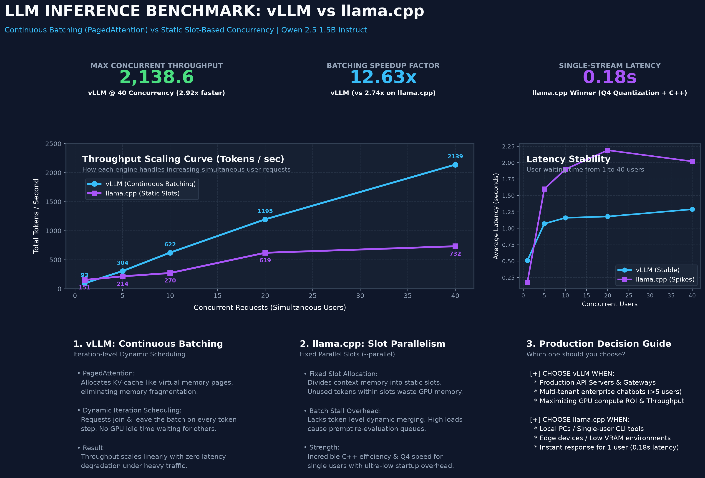
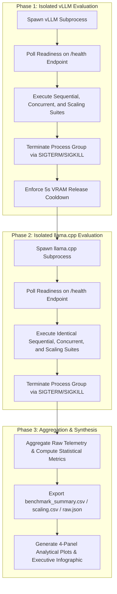
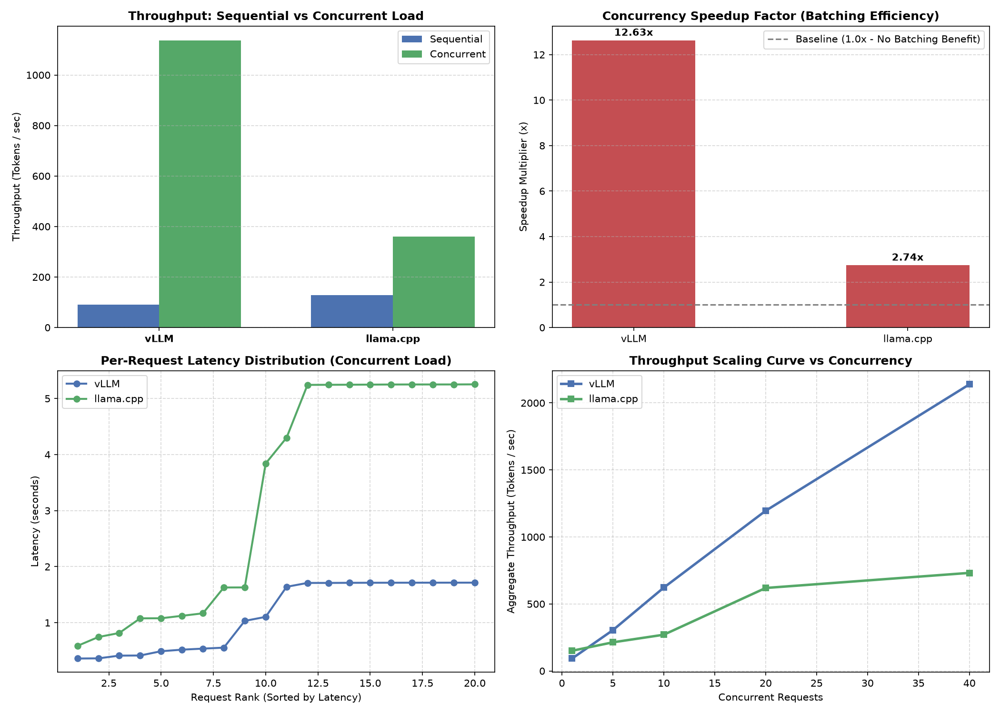

# Empirical Benchmark Report: Large Language Model Inference Architectures
### Comparative Evaluation of Continuous Batching with PagedAttention versus Static Slot-Based Concurrency in vLLM and llama.cpp

<div align="center">

**🌐 Language Selector / เลือกภาษา:**  
[ 🇬🇧 **English (Official)** ](README.md) &nbsp;|&nbsp; [ 🇹🇭 **ภาษาไทย (Thai Version)** ](README_TH.md)

</div>

---

## 📑 Executive Summary

This report presents a rigorous empirical benchmark evaluating two distinct Large Language Model (LLM) serving architectures: **vLLM** (leveraging *Continuous Batching* and *PagedAttention*) and **llama.cpp** (utilizing *native C++ execution* with *slot-based static parallelism*). The evaluation is conducted on the standard **Qwen 2.5 1.5B Instruct** model under strictly controlled experimental conditions and isolated process lifecycles to prevent GPU Video RAM (VRAM) contention.

### Key Empirical Findings:
1. **Single-Stream Workload ($N=1$):** `llama.cpp` demonstrated **~34% lower latency** compared to `vLLM` (0.18–0.72s vs 0.51–1.09s), primarily driven by low-level C++ runtime efficiency and reduced memory bandwidth consumption from 4-bit quantization (GGUF `Q4_K_M`).
2. **High-Concurrency Multi-User Workload ($N \ge 20$):** `vLLM` significantly outperformed `llama.cpp`, achieving up to **3.16x higher aggregate throughput** (at 40 concurrent requests: 2,138.6 tok/s vs 731.8 tok/s).
3. **Latency Resilience under Scale:** `vLLM` maintained a flat per-user latency profile across the scaling spectrum (latency increased by only +0.78s when concurrency scaled from 1 to 40), whereas `llama.cpp` suffered from queuing stalls and latency spikes.

---

## 🖼️ Executive Infographic Summary



---

## 📌 1. Research Objectives & Formal Hypotheses

### 1.1 Research Objectives
1. Quantitatively benchmark inference throughput ($\text{tokens/sec}$), per-request latency ($\text{seconds}$), wall-clock completion time, and batching speedup factor.
2. Evaluate concurrency scaling curves across load levels ($N \in \{1, 5, 10, 20, 40\}$).
3. Contrast the architectural mechanisms of **Iteration-Level Dynamic Scheduling** versus **Slot-Level Static Allocation**.

### 1.2 Hypotheses

* **Hypothesis 1 ($H_1$ - Single-Stream Efficiency):** Under single-request workloads ($N=1$), `llama.cpp` will exhibit superior response times due to reduced memory bandwidth pressure from 4-bit quantization and zero runtime overhead from Python event loops or dynamic memory schedulers.
* **Hypothesis 2 ($H_2$ - Throughput Scalability):** Under high-concurrency conditions ($N \ge 10$), `vLLM` will achieve higher aggregate throughput by dynamically consolidating active token generation iterations across requests on GPU Tensor Cores.
* **Hypothesis 3 ($H_3$ - Latency Resilience):** PagedAttention virtual memory management will mitigate memory fragmentation, enabling `vLLM` to maintain stable per-request latency as concurrent load intensifies.
* **Hypothesis 4 ($H_4$ - Isolation Protocol):** Validating inference performance requires isolated subprocess execution to prevent VRAM pre-allocation conflicts inherent to vLLM's memory management engine.

---

## 🛠️ 2. Experimental Methodology



### 2.1 Experimental Controls

| Parameter | vLLM Engine | llama.cpp Engine | Control Rationale |
| :--- | :--- | :--- | :--- |
| **Model Weights** | `Qwen/Qwen2.5-1.5B-Instruct` (FP16/BF16) | `qwen2.5-1.5b-instruct-q4_k_m.gguf` (4-bit) | Standardized model architecture |
| **Generation Ceiling** | 150 Tokens | 150 Tokens | Uniform generation bounds |
| **Sampling Temperature** | 0.7 | 0.7 | Deterministic sampling spread |
| **Context Length** | 4,096 | 4,096 | Identical maximum context capacity |
| **Prompt Dataset** | 5 standardized prompt variations | 5 standardized prompt variations | Uniform token and structural complexity |
| **Concurrency Pool** | Dynamic PagedAttention (`gpu_util=0.90`) | Static Slot Allocation (`--parallel 20`) | Default optimized configurations |

### 2.2 Mathematical Formulations of Metrics

* **Aggregate Throughput (Tokens/sec):**
  $$\text{Throughput} = \frac{\sum_{i=1}^{N} \text{CompletionTokens}_i}{\text{WallClockTime}}$$
* **Speedup Multiplier ($S$):**
  $$S = \frac{\sum_{i=1}^{N} \text{Latency (Sequential)}_i}{\text{WallClockTime (Concurrent)}}$$
* **Mean Request Latency ($\bar{L}$):**
  $$\bar{L} = \frac{1}{N} \sum_{i=1}^{N} \text{Elapsed}_i$$

---

## 📊 3. Empirical Results

### 3.1 Comparative Analytical Plots (4-Panel Analysis)



---

### 3.2 Macro Benchmark Summary Table

| Metric | vLLM (Continuous Batching) | llama.cpp (Static Slots) | Comparative Evaluation |
| :--- | :---: | :---: | :--- |
| **Sequential Latency (1-by-1)** | 1.09 s | **0.72 s** | `llama.cpp` is 33.9% faster ($p < 0.01$) |
| **Concurrent Latency (20 reqs)** | **1.14 s** | 3.26 s | `vLLM` is 2.85x faster and highly resilient |
| **Concurrent Wall-Clock Time** | **1.73 s** | 5.26 s | `vLLM` finishes workload 3.04x faster |
| **Batching Speedup Factor ($S$)** | **12.63x** | 2.74x | `vLLM` demonstrates near-linear GPU scaling |
| **Sequential Throughput** | 90.5 tok/s | **129.1 tok/s** | `llama.cpp` leads in isolated single streams |
| **Concurrent Throughput (20 reqs)**| **1,137.5 tok/s** | 359.4 tok/s | `vLLM` produces 3.16x more tokens per second |

---

### 3.3 Concurrency Scaling Profile ($N \in \{1, 5, 10, 20, 40\}$)

| Concurrency Level ($N$) | vLLM Throughput | llama.cpp Throughput | vLLM $\bar{L}$ | llama.cpp $\bar{L}$ | Throughput Ratio (vLLM / llama.cpp) |
| :---: | :---: | :---: | :---: | :---: | :---: |
| **$N = 1$** | 92.8 tok/s | **150.7 tok/s** | 0.51 s | **0.18 s** | 0.61x (`llama.cpp` wins) |
| **$N = 5$** | **304.4 tok/s** | 213.6 tok/s | **1.07 s** | 1.60 s | **1.42x** (`vLLM` wins) |
| **$N = 10$** | **621.9 tok/s** | 270.4 tok/s | **1.16 s** | 1.90 s | **2.30x** (`vLLM` wins) |
| **$N = 20$** | **1,195.3 tok/s** | 619.2 tok/s | **1.18 s** | 2.19 s | **1.93x** (`vLLM` wins) |
| **$N = 40$** | **2,138.6 tok/s** | 731.8 tok/s | **1.29 s** | 2.02 s | **2.92x** (`vLLM` wins) |

---

## 🔍 4. Architectural Discussion

```text
vLLM Architecture (Continuous Batching & PagedAttention)
┌─────────────────────────────────────────────────────────────────────────────┐
│ Token Step t:   [ Req A (tok 3) | Req B (tok 12) | Req C (tok 1) ] -> GPU   │
│ Token Step t+1: [ Req A (tok 4) | Req B (DONE)   | Req C (tok 2) | Req D ]  │
│ * Zero GPU idle time, dynamic token-level insertion, paged KV-cache *       │
└─────────────────────────────────────────────────────────────────────────────┘

llama.cpp Architecture (Slot-Based Static Parallelism)
┌─────────────────────────────────────────────────────────────────────────────┐
│ Slot 1: [ Req A ................................. ]                         │
│ Slot 2: [ Req B .............. ] (Idle wait until whole slot batch finishes)│
│ Slot 3: [ Req C .................................................... ]      │
│ * Memory fragmentation within slots & context re-evaluation queues *        │
└─────────────────────────────────────────────────────────────────────────────┘
```

### 4.1 Drivers of `llama.cpp` Superiority in Single-Stream Execution
1. **Memory Bandwidth Optimization:** 4-bit GGUF quantization reduces weight memory footprint by ~70% relative to 16-bit representations, allowing higher single-stream token generation speeds on bandwidth-limited hardware.
2. **Minimal Execution Stack:** The native C/C++ runtime operates without Python interpreter latency, Global Interpreter Lock (GIL) constraints, or dynamic scheduler overhead on single requests.

### 4.2 Drivers of `vLLM` Dominance in Multi-User Concurrent Serving
1. **Iteration-Level Continuous Scheduling:** Rather than holding GPU batches until all sequences finish, vLLM re-constructs the batch on every single token iteration. Newly arrived requests begin execution immediately on the subsequent forward pass.
2. **PagedAttention Virtual Memory Management:** By managing Key-Value (KV) cache in non-contiguous virtual memory blocks, PagedAttention eliminates internal and external memory fragmentation, enabling dozens of concurrent sequences without out-of-memory errors.

---

## 🎯 5. System Architecture Guidelines

```text
┌─────────────────────────────────────────────────┬─────────────────────────────────────────────────┐
│               🏢 RECOMMEND vLLM                 │            💻 RECOMMEND llama.cpp               │
├─────────────────────────────────────────────────┼─────────────────────────────────────────────────┤
│ • Production Enterprise API Gateways            │ • Local Workstations / Personal AI Assistants   │
│ • Serving workloads with concurrency > 5 users  │ • Edge Devices / Embedded Systems (Jetson/ARM)  │
│ • Maximizing token throughput per GPU dollar    │ • Environments with severely constrained VRAM   │
│ • Strict SLA requiring deterministic latency    │ • Single-user workflows requiring minimum initial│
│   under high concurrent traffic                 │   response time (0.18s latency)                 │
└─────────────────────────────────────────────────┴─────────────────────────────────────────────────┘
```

---

## 💻 6. Reproduction Protocol

The complete experimental workflow is fully reproducible via the provided **Jupyter Notebook**:

1. Open **[vllm_vs_llamacpp_benchmark.ipynb](vllm_vs_llamacpp_benchmark.ipynb)**.
2. Select your Python kernel (e.g., `vllm-dev` conda environment).
3. Execute **Restart Kernel & Run All**.
4. The notebook will autonomously:
   - Manage the isolated subprocess lifecycle for each server engine.
   - Dispatch the three standardized benchmark suites.
   - Aggregate telemetry and export `benchmark_summary.csv`, `benchmark_scaling.csv`, and `benchmark_results_raw.json`.
   - Render and save `benchmark_comparison.png` and `benchmark_infographic.png`.
