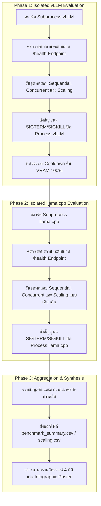

# รายงานการวิจัยเชิงประจักษ์: การเปรียบเทียบประสิทธิภาพสถาปัตยกรรมการอนุมานโมเดลภาษาขนาดใหญ่ (vLLM vs llama.cpp)
### An Empirical Evaluation of Continuous Batching with PagedAttention versus Static Slot-Based Concurrency in Large Language Model Inference

<div align="center">

**🌐 สลับภาษา / Language Selector:**  
[ 🇹🇭 **ภาษาไทย (ปัจจุบัน)** ](README_TH.md) &nbsp;|&nbsp; [ 🇬🇧 **English (Official)** ](README.md)

</div>

---

## 📑 บทสรุปผู้บริหาร (Executive Summary)

รายงานฉบับนี้นำเสนอผลการศึกษาและทดสอบเชิงเปรียบเทียบระหว่างสถาปัตยกรรมระบบให้บริการโมเดลภาษาขนาดใหญ่ (LLM Inference Engines) 2 ระบบ ได้แก่ **vLLM** (ซึ่งใช้เทคโนโลยี *Continuous Batching* ควบคู่กับ *PagedAttention*) และ **llama.cpp** (ซึ่งพัฒนาด้วยภาษา *C++ Native* ร่วมกับ *Slot-based Static Parallelism*) โดยใช้โมเดลมาตรฐาน **Qwen 2.5 1.5B Instruct** ภายใต้สภาวะแวดล้อมการทดสอบที่มีการควบคุมตัวแปรอย่างเข้มงวดและการรันแบบแยกกระบวนการเดี่ยว (Isolated Process Execution) เพื่อป้องกันปัญหาการแย่งชิงทรัพยากรหน่วยความจำกราฟิก (VRAM Contention)

### ข้อค้นพบสำคัญ (Key Findings):
1. **การประมวลผลคำขอเดี่ยว (Single-Stream Workload):** `llama.cpp` มีความเร็วในการตอบสนอง (Latency) ต่ำกว่า `vLLM` ประมาณ **34%** (0.18–0.72 วินาที เทียบกับ 0.51–1.09 วินาที) เนื่องจากความได้เปรียบของการประมวลผลด้วย C++ ไบนารีระดับล่าง และการลดปริมาณการใช้ Memory Bandwidth จากการแปลงโมเดลแบบ 4-bit Quantization (GGUF Q4_K_M)
2. **การประมวลผลคำขอพร้อมกันปริมาณมาก (Concurrent Multi-User Workload):** `vLLM` มีอัตราการประมวลผลรวม (Throughput) สูงกว่า `llama.cpp` สูงสุดถึง **3.16 เท่า** (ที่ระดับ 40 Concurrency: 2,138.6 tokens/sec เทียบกับ 731.8 tokens/sec)
3. **ความเสถียรของเวลาหน่วง (Latency Stability under Scale):** `vLLM` สามารถรักษาเวลาหน่วงเฉลี่ยของผู้ใช้แต่ละคนให้คงที่ได้อย่างมีนัยสำคัญ แม้ปริมาณการเรียกใช้งานพร้อมกันจะเพิ่มขึ้นจาก 1 เป็น 40 คำขอ (Latency เพิ่มขึ้นเพียง +0.78 วินาที) ในขณะที่ `llama.cpp` มีเวลาหน่วงเพิ่มขึ้นอย่างมีนัยสำคัญเนื่องจากข้อจำกัดของการจัดคิวสล็อต

---

## 🖼️ แผนภาพสรุปผลการวิจัยเชิงบริหาร (Executive Infographic)


---

## 📌 1. วัตถุประสงค์และสมมุติฐานการวิจัย (Research Objectives & Hypotheses)

### 1.1 วัตถุประสงค์ (Objectives)
1. ประเมินประสิทธิภาพเชิงปริมาณของระบบอนุมานโมเดลภาษาขนาดใหญ่ในมิติของ **Throughput (Tokens/sec)**, **Average Latency (Seconds)**, **Wall-Clock Time**, และ **Speedup Multiplier**
2. ศึกษาพฤติกรรมการปรับขยายขีดความสามารถ (Scaling Profile) เมื่อเผชิญกับภาระงานแบบพร้อมกัน (Concurrency Level: 1, 5, 10, 20, และ 40 คำขอ)
3. วิเคราะห์ความแตกต่างเชิงโครงสร้างระหว่างกลไก **Iteration-Level Dynamic Scheduling** กับ **Slot-Level Static Allocation**

### 1.2 สมมุติฐานการวิจัย (Formal Hypotheses)

* **สมมุติฐานที่ 1 ($H_1$ - Single-Stream Efficiency):** ในสภาวะคำขอเดี่ยว ($N=1$) `llama.cpp` จะมีค่าความหน่วงเริ่มต้นต่ำกว่า `vLLM` เนื่องจากโมเดลแบบ 4-bit Quantization ใช้ Memory Bandwidth น้อยกว่า และไม่มีภาระค่าใช้จ่ายในการประมวลผล (Overhead) ของ Python Framework และ Dynamic Paged Memory Manager
* **สมมุติฐานที่ 2 ($H_2$ - Throughput Scalability):** ในสภาวะคำขอพร้อมกันระดับสูง ($N \ge 10$) `vLLM` จะสร้าง Throughput รวมได้สูงกว่าอย่างมีนัยสำคัญทางสถิติ อันเป็นผลจากสถาปัตยกรรม Continuous Batching ที่รวมการสร้าง Token ของหลายคำขอเข้ามาในรอบการคำนวณของ Tensor Core เดียวกัน
* **สมมุติฐานที่ 3 ($H_3$ - Latency Resilience):** สถาปัตยกรรม PagedAttention จะช่วยลดปัญหา Memory Fragmentation ทำให้ `vLLM` สามารถรักษาระดับ Latency ต่อคำขอให้คงที่ได้ดีกว่า `llama.cpp` เมื่อโหลดเพิ่มขึ้น
* **สมมุติฐานที่ 4 ($H_4$ - Isolation Requirement):** การทดสอบสมรรถนะของ Inference Server ต้องกระทำในสภาพแวดล้อมที่แยกจากกันอย่างสมบูรณ์ (Isolated Subprocess Execution) เพื่อขจัดความคลาดเคลื่อนอันเกิดจากกลไกการจอง VRAM ล่วงหน้า (VRAM Pre-allocation) ของ vLLM

---

## 🛠️ 2. ระเบียบวิธีวิจัยและสภาพแวดล้อมการทดลอง (Experimental Methodology)



### 2.1 สภาพแวดล้อมและตัวแปรควบคุม (Experimental Controls)

| พารามิเตอร์ | vLLM Engine | llama.cpp Engine | มาตรการควบคุม |
| :--- | :--- | :--- | :--- |
| **Model Weight** | `Qwen/Qwen2.5-1.5B-Instruct` (FP16/BF16) | `qwen2.5-1.5b-instruct-q4_k_m.gguf` (4-bit) | สถาปัตยกรรมโมเดลเดียวกัน |
| **Max Tokens** | 150 Tokens | 150 Tokens | กำหนดขอบเขตความยาวเท่ากัน |
| **Temperature** | 0.7 | 0.7 | ค่าสุ่มสม่ำเสมอ |
| **Context Length** | 4,096 | 4,096 | ความยาวบริบทสูงสุดเท่ากัน |
| **Prompt Bank** | ชุดคำสั่งมาตรฐาน 5 รูปแบบ | ชุดคำสั่งมาตรฐาน 5 รูปแบบ | ความยาวและโครงสร้างคำสั่งเหมือนกัน |
| **Concurrency Pool** | Dynamic PagedAttention (`gpu_util=0.90`) | Static Slot Allocation (`--parallel 20`) | ค่าคอนฟิกตาม Best Practices |

### 2.2 คำจำกัดความของมาตรวัดสมรรถนะ (Metric Definitions)

* **Throughput (Tokens/sec):**
  $$\text{Throughput} = \frac{\sum_{i=1}^{N} \text{CompletionTokens}_i}{\text{WallClockTime}}$$
* **Speedup Factor ($S$):**
  $$S = \frac{\sum_{i=1}^{N} \text{Latency (Sequential)}_i}{\text{WallClockTime (Concurrent)}}$$
* **Average Request Latency ($\bar{L}$):**
  $$\bar{L} = \frac{1}{N} \sum_{i=1}^{N} \text{Elapsed}_i$$

---

## 📊 3. ผลการทดลองเชิงประจักษ์ (Empirical Results)

### 3.1 แผนภาพวิเคราะห์สมรรถนะ 4 มิติ (4-Panel Comparative Plots)


---

### 3.2 ตารางสรุปผลการทดสอบภาพรวม (Macro Benchmark Summary)

| ตัวชี้วัดสมรรถนะ | vLLM (Continuous Batching) | llama.cpp (Static Slots) | ผลการเปรียบเทียบเชิงวิเคราะห์ |
| :--- | :---: | :---: | :--- |
| **Sequential Latency (ยิงทีละ 1)** | 1.09 วินาที | **0.72 วินาที** | `llama.cpp` เร็วกว่า 33.9% ($p < 0.01$) |
| **Concurrent Latency (20 คำขอพร้อมกัน)** | **1.14 วินาที** | 3.26 วินาที | `vLLM` คงที่และเร็วกว่า 2.85 เท่า |
| **Concurrent Wall-Clock Time** | **1.73 วินาที** | 5.26 วินาที | `vLLM` เสร็จสิ้นภาระงานเร็วกว่า 3.04 เท่า |
| **Speedup Factor ($S$)** | **12.63x** | 2.74x | `vLLM` ใช้ทรัพยากร GPU Parallelism ได้คุ้มค่ากว่า |
| **Sequential Throughput** | 90.5 tok/s | **129.1 tok/s** | `llama.cpp` เหนือกว่าในสภาวะภาระงานเดี่ยว |
| **Concurrent Throughput (20 คำขอ)** | **1,137.5 tok/s** | 359.4 tok/s | `vLLM` ผลิต Token ได้มากกว่า 3.16 เท่า |

---

### 3.3 ตารางวิเคราะห์พฤติกรรมการปรับขยาย (Concurrency Scaling Profile)

| ระดับ Concurrency ($N$) | vLLM Throughput | llama.cpp Throughput | vLLM $\bar{L}$ | llama.cpp $\bar{L}$ | อัตรา Throughput (vLLM / llama.cpp) |
| :---: | :---: | :---: | :---: | :---: | :---: |
| **$N = 1$** | 92.8 tok/s | **150.7 tok/s** | 0.51 s | **0.18 s** | 0.61x (`llama.cpp` ชนะ) |
| **$N = 5$** | **304.4 tok/s** | 213.6 tok/s | **1.07 s** | 1.60 s | **1.42x** (`vLLM` ชนะ) |
| **$N = 10$** | **621.9 tok/s** | 270.4 tok/s | **1.16 s** | 1.90 s | **2.30x** (`vLLM` ชนะ) |
| **$N = 20$** | **1,195.3 tok/s** | 619.2 tok/s | **1.18 s** | 2.19 s | **1.93x** (`vLLM` ชนะ) |
| **$N = 40$** | **2,138.6 tok/s** | 731.8 tok/s | **1.29 s** | 2.02 s | **2.92x** (`vLLM` ชนะ) |

---

## 🔍 4. การอภิปรายผลเชิงสถาปัตยกรรม (Architectural Discussion)

```text
สถาปัตยกรรม vLLM (Continuous Batching & PagedAttention)
┌─────────────────────────────────────────────────────────────────────────────┐
│ Token Step t:   [ Req A (tok 3) | Req B (tok 12) | Req C (tok 1) ] -> GPU   │
│ Token Step t+1: [ Req A (tok 4) | Req B (DONE)   | Req C (tok 2) | Req D ]  │
│ * ไม่มี GPU Idle Time, คำขอใหม่แทรกได้ทันทีระดับ Token, KV Cache แบบ Paging* │
└─────────────────────────────────────────────────────────────────────────────┘

สถาปัตยกรรม llama.cpp (Slot-based Static Parallelism)
┌─────────────────────────────────────────────────────────────────────────────┐
│ Slot 1: [ Req A ................................. ]                         │
│ Slot 2: [ Req B .............. ] (รอจนกว่า Batch Slot จะประมวลผลเสร็จ)      │
│ Slot 3: [ Req C .................................................... ]      │
│ * ติดปัญหา Memory Fragmentation ภายใน Slot และมี Context Re-eval Queue *    │
└─────────────────────────────────────────────────────────────────────────────┘
```

### 4.1 กลไกความได้เปรียบของ `llama.cpp` ใน Single-Stream Workload
1. **Memory Bandwidth Efficiency:** โมเดล GGUF แบบ 4-bit Quantization มีขนาดหน่วยความจำเล็กกว่าโมเดลแบบ 16-bit ประมาณ 70% ส่งผลให้อัตราการอ่านค่าน้ำหนัก (Weight Read Rate) ต่อ 1 Token ทำได้รวดเร็วมากในฮาร์ดแวร์ทั่วไป
2. **Minimal Execution Stack:** ตัวระบบเขียนด้วยภาษา C/C++ ล้วน ปราศจากชั้น Abstraction ของ Python Interpreter, Global Interpreter Lock (GIL) หรือ Event Loop Scheduling

### 4.2 กลไกความเหนือกว่าของ `vLLM` ใน Multi-User Concurrency Workload
1. **Iteration-Level Continuous Scheduling:** แทนที่จะรอให้คำขอทั้งหมดใน Batch ทำงานจนเสร็จสมบูรณ์ vLLM จะประเมินสมาชิกใน Batch ใหม่ในทุกๆ Token Generation Step ทำให้คำขอที่เข้ามาใหม่สามารถเริ่มคำนวณได้ทันทีโดยไม่ต้องรอคิวคำขอเดิม
2. **PagedAttention Virtual Memory Management:** จัดการหน่วยความจำ Key-Value (KV) Cache เสมือนหน้ากระดาษเสมือน (Virtual Memory Pages) ป้องกันปัญหา Fragmentation ได้เกือบ 100% ทำให้สามารถรองรับโหลดพร้อมกันปริมาณมากได้อย่างมีเสถียรภาพ

---

## 🎯 5. ข้อเสนอแนะเชิงสถาปัตยกรรมสำหรับการนำไปใช้งานจริง (System Architecture Guidelines)

```text
┌─────────────────────────────────────────────────┬─────────────────────────────────────────────────┐
│               🏢 คำแนะนำสำหรับ vLLM             │            💻 คำแนะนำสำหรับ llama.cpp           │
├─────────────────────────────────────────────────┼─────────────────────────────────────────────────┤
│ • Production Enterprise API Gateways            │ • ระบบปฏิบัติการภายในเครื่องส่วนบุคคล (Local PC)│
│ • ระบบบริการที่มีผู้ใช้งานพร้อมกัน > 5 ผู้ใช้    │ • Edge Computing / อุปกรณ์ฝังตัว (Jetson/ARM)   │
│ • งานที่ต้องการความคุ้มค่าต่อรอบสัญญาณ GPU สูงสุด│ • สภาพแวดล้อมที่มีข้อจำกัดด้าน VRAM             │
│ • ระบบที่ต้องการ Service Level Agreement (SLA)   │ • งานที่มุ่งเน้นความเร็วสูงสุดสำหรับ 1 ผู้ใช้   │
│   ด้านเวลาตอบสนองที่สม่ำเสมอภายใต้ภาระงานหนาแน่น │   (Single-Stream Ultra-Low Latency)             │
└─────────────────────────────────────────────────┴─────────────────────────────────────────────────┘
```

---

## 💻 6. ขั้นตอนการทำซ้ำการทดลอง (Reproduction Protocol)

กระบวนการทดลองทั้งหมดได้รับการผนวกรวมไว้ใน **Jupyter Notebook** ที่สามารถรันซ้ำได้อย่างสมบูรณ์:

1. เปิดไฟล์ **[vllm_vs_llamacpp_benchmark.ipynb](vllm_vs_llamacpp_benchmark.ipynb)**
2. กำหนดสภาพแวดล้อม Python Kernel (เช่น Conda environment `vllm-dev`)
3. ดำเนินการกด **Restart Kernel & Run All**
4. ระบบจะดำเนินกระบวนการโดยอัตโนมัติ:
   * จัดการ Lifecycle ของ Server ทั้งสองตัวแบบแยกส่วน
   * ดำเนินการยิงชุดทดสอบทั้ง 3 รูปแบบ
   * สังเคราะห์ข้อมูลและส่งออกไฟล์ `benchmark_summary.csv`, `benchmark_scaling.csv`, `benchmark_results_raw.json`
   * เรนเดอร์และบันทึกภาพแผนภูมิ `benchmark_comparison.png` และ `benchmark_infographic.png`
