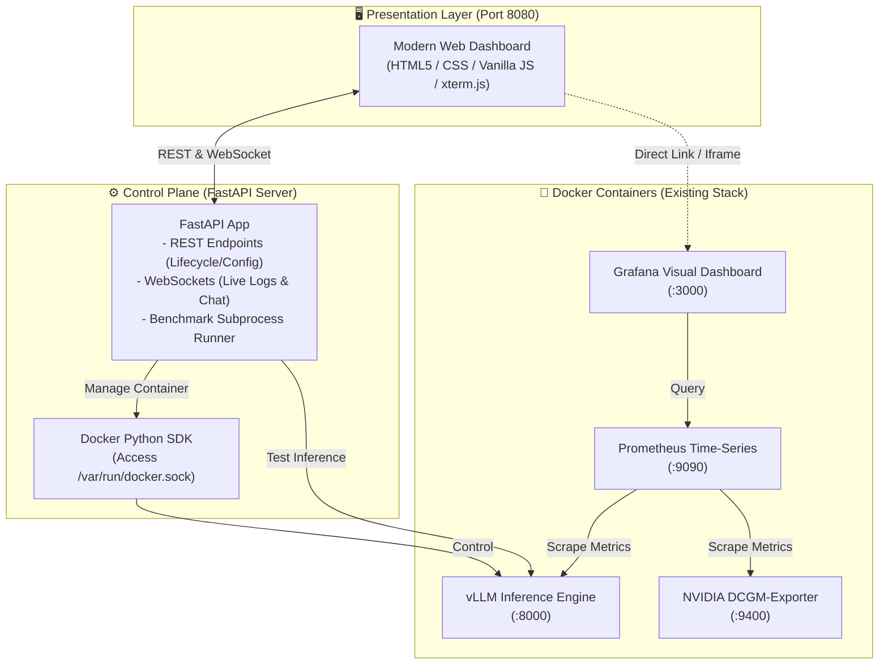
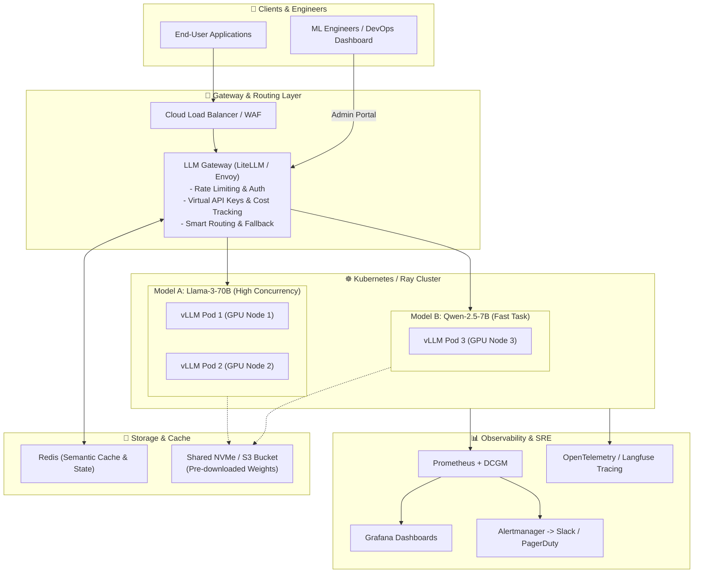

# 🎛️ vLLM Control Dashboard & Production Architecture Specification

เอกสารการออกแบบเชิงสถาปัตยกรรมและข้อกำหนดการทำงาน (System Architecture & Technical Design Specification) สำหรับระบบ **vLLM Control Dashboard** ทั้งในสภาพแวดล้อม **Sandbox / การทดลองระดับ Local** และ **Enterprise Production**

---

## 📌 1. วัตถุประสงค์ (Executive Summary)

ในการทดลองและใช้งานโมเดลภาษาขนาดใหญ่ (LLM) ด้วย **vLLM Engine**:
* **ปัญหาเดิม:** การสลับโมเดล ปรับพารามิเตอร์ (`--gpu-memory-utilization`, `--max-model-len`, `--quantization`) และการรัน Benchmark ต้องทำผ่านคำสั่ง CLI/Terminal และแก้ไฟล์คอนฟิกซ้ำๆ
* **เป้าหมาย:** สร้าง **Control Dashboard** ที่ทำหน้าที่เป็น "Control Plane" ศูนย์กลางเพื่อ:
  1. สลับโมเดลและปรับแต่งค่าคอนฟิกได้แบบ Real-time ด้วยคลิกเดียว
  2. ควบคุมสถานะ Lifecycle (Start / Stop / Restart) ของ vLLM Container
  3. สตรีมมิ่ง Live Logs และแสดงไฟสถานะ (Health/Ready State)
  4. ทดสอบความเร็วและคุยกับโมเดลได้ทันที (Prompt Playground)
  5. สั่งรันโหลดเทสต์ (Benchmark Integration) และเชื่อมต่อมาตรวัดจาก Grafana ได้อย่างครบวงจร

---

## 🏗️ 2. ภาพรวมสถาปัตยกรรม (System Architecture)

### 2.1 สถาปัตยกรรมระดับ Sandbox / Local Dev (สำหรับงานทดลอง & Benchmark)

ออกแบบให้รันเป็น Microservice ขนาดเล็ก เสริมเข้าไปใน [docker-compose.yml](file:///home/yummyaom/Projects/VLLM/docker-compose.yml) เดิม



---

### 2.2 สถาปัตยกรรมระดับ Enterprise Production (Zero-Downtime & Multi-Node)

ออกแบบเพื่อรองรับผู้ใช้งานจริงระดับองค์กร มีการกระจายโหลด ป้องกัน Downtime และปลอดภัยสูง



---

## 📋 3. ข้อกำหนดฟังก์ชันการทำงาน (Functional Requirements)

| โมดูล (Module) | รายละเอียดฟังก์ชัน (Features) |
| :--- | :--- |
| **1. Model Switcher & Presets** | • มี Dropdown และช่องกรอก Hugging Face Model ID<br>• มีปุ่มบันทึก/โหลด Preset โมเดลที่ใช้บ่อย (เช่น Qwen, Llama, Mistral)<br>• ปรับ Flag: `--gpu-memory-utilization` (0.1 - 0.95), `--max-model-len`, `--dtype`, `--quantization` (AWQ/GPTQ/BitsAndBytes) |
| **2. Lifecycle Management** | • ปุ่ม **Launch / Restart / Stop** Container<br>• แสดงไฟสถานะ Real-time: 🟢 `Ready` / 🟡 `Loading Weights` / 🔴 `Stopped` / ⚠️ `OOM Error`<br>• ตรวจสอบ Health check endpoint (`/health`) ของ vLLM อัตโนมัติ |
| **3. Real-time Live Log Console** | • สตรีม Log จาก Docker container ขึ้นมาแสดงบนหน้าเว็บผ่าน WebSocket<br>• ระบบ Auto-scroll และตัวกรองค้นหาคำผิดพลาด (เช่น `OutOfMemoryError`, `CUDA error`) |
| **4. Quick Prompt Playground** | • กล่องแชตสำหรับทดสอบยิง Prompt ตรงเข้าโมเดล<br>• วัดสถิติการตอบกลับแบบทันที: **TTFT (Time To First Token)**, **Generation Speed (Tokens/s)** และ **Total Latency** |
| **5. Benchmark Trigger** | • หน้าต่างกำหนดค่า Benchmark: Concurrency, Prompt Length, Number of Requests<br>• ปุ่มสั่งรันสคริปต์ Benchmark ในโฟลเดอร์ `benchmark_test/`<br>• สรุปผลตัวเลข RPS, P50/P99 Latency ออกมาเป็นตารางสรุป |
| **6. Observability Link** | • ปุ่มลัดและวิดเจ็ตแสดงผลสถานะ GPU VRAM และลิงก์เปิดหน้า Grafana Dashboard ทันที |

---

## 💻 4. รายละเอียดชุดเทคโนโลยี (Tech Stack Specification)

| ส่วนประกอบ (Component) | Sandbox / Local Stack | Enterprise Production Stack |
| :--- | :--- | :--- |
| **Frontend UI** | Vanilla HTML5 + Modern CSS + JavaScript (`xterm.js` for logs) | Next.js (React) + TypeScript + TailwindCSS + shadcn/ui |
| **Backend API** | Python (FastAPI) + `docker` SDK + WebSockets | FastAPI / Go + Kubernetes Client SDK (`client-go`) |
| **Routing / Proxy** | Direct Docker Port Mapping (:8000) | LiteLLM Proxy / Envoy Gateway with Virtual Keys |
| **Data Persistence** | Local JSON / YAML Configs | PostgreSQL (Configs/Audit logs) + Redis (Cache) |
| **Deployment Mode** | Docker Compose Service | Kubernetes StatefulSet / KServe / Ray Cluster |
| **Monitoring** | Prometheus + DCGM-Exporter + Grafana | Prometheus + Grafana + OpenTelemetry + Alertmanager |

---

## 🔌 5. การออกแบบ API Endpoints (API Specification)

```text
# --- Control & Lifecycle APIs ---
GET    /api/vllm/status          # ดึงสถานะปัจจุบันของ vLLM (running, loading, stopped)
POST   /api/vllm/start           # สั่ง Start/Restart vLLM พร้อมส่ง JSON config
POST   /api/vllm/stop            # สั่งหยุดการทำงาน vLLM เพื่อคืน VRAM
GET    /api/vllm/presets         # ดึงรายการ Preset โมเดลที่บันทึกไว้
POST   /api/vllm/presets         # เพิ่ม/แก้ไข Preset โมเดล

# --- Realtime WebSocket APIs ---
WS     /ws/vllm/logs             # สตรีม Docker container logs สด
WS     /ws/vllm/chat             # สตรีม Chat completions ตอบกลับแบบ Token-by-Token

# --- Benchmark APIs ---
POST   /api/benchmark/run        # สั่งรันสคริปต์ Benchmark พร้อมรับผลสรุป
GET    /api/benchmark/history    # ดูประวัติผลการทดสอบย้อนหลัง
```

---

## 🎨 6. โครงร่างหน้าตา Dashboard (UI Wireframe Layout)

```text
+---------------------------------------------------------------------------------------------------+
|  🚀 vLLM Control Dashboard               [Status: 🟢 READY]  [GPU VRAM: 14.2 / 16.0 GB (88%)]    |
+---------------------------------------------------+-----------------------------------------------+
| ⚙️ MODEL & HARDWARE CONFIGURATION                  | 📜 LIVE CONTAINER CONSOLE LOGS                |
| Model ID: [ Qwen/Qwen2.5-7B-Instruct            ] | [13:10:02] Loading model weights... 80%      |
| Preset:   [ Default 7B Model ▼ ] [Save Preset]    | [13:10:15] Model weights loaded successfully. |
|                                                   | [13:10:16] vLLM Engine ready on port 8000.    |
| GPU Memory Limit: [ 0.85 ] =====o======           | --------------------------------------------- |
| Max Model Length: [ 4096 ] ============           | [x] Auto-scroll   [ Clear Log ]  [ Copy Log ] |
| Quantization:     [ None / FP16 ▼ ]               |                                               |
|                                                   +-----------------------------------------------+
| [ ▶ Apply & Launch Model ]  [ ⏹ Stop Engine ]     | 💬 QUICK PROMPT PLAYGROUND                    |
+---------------------------------------------------+ Prompt: [ อธิบาย Continuous Batching สั้นๆ ]  |
| 🚀 LOAD BENCHMARK RUNNER                          | Response: Continuous batching คือ...          |
| Concurrency (Users): [ 10 ]  Requests: [ 100 ]    | Speed: 78.4 tok/s | TTFT: 140ms | Total: 1.8s |
| [ Start Benchmark Test ]                          +-----------------------------------------------+
| Latency P50: 120ms | P99: 380ms | RPS: 42.5 req/s | 📊 [ Open Grafana Telemetry Dashboard ↗ ]     |
+---------------------------------------------------+-----------------------------------------------+
```

---

## 🛣️ 7. แผนการพัฒนาและติดตั้ง (Implementation Roadmap)

1. **Phase 1: Local Control Service MVP**
   * พัฒนา FastAPI backend (`dashboard_backend.py`) ต่อกับ Docker Socket
   * สร้าง Single-page Web UI (`dashboard_ui`) สำหรับ Start/Stop/Config และ Live Logs
   * เพิ่ม service `vllm-dashboard` ลงใน `docker-compose.yml`
2. **Phase 2: Benchmark & Telemetry Integration**
   * เชื่อมต่อสคริปต์ใน `benchmark_test/` ให้กด Trigger และดูผลได้จากหน้าเว็บ
   * ทำปุ่ม Deep Link / Embed Grafana Panel
3. **Phase 3: Production Readiness Migration (Optional)**
   * ปรับ Backend ให้รองรับ Kubernetes API หรือต่อผ่าน LiteLLM Gateway สำหรับ Multi-Model Deployment
